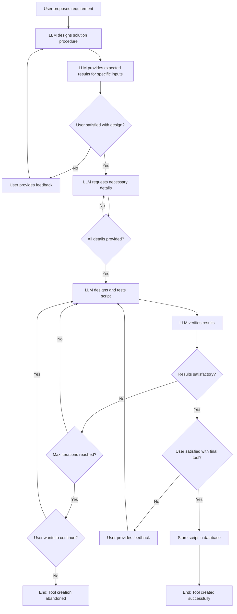

# LLMToolCraft

This project is part of the [Pervasive AI Developer Contest](https://www.hackster.io/contests/amd2023). It is actively maintained. 

**For the version prior to the submission deadline, please visit the `old` branch.**

## How to Run

### Clipboard Setup

To set up the Clipboard Queue shortcut in Ubuntu:

1. Go to System > Keyboard > View and Customize Shortcuts > Custom Shortcuts
2. Create a new shortcut with the following details:
   - Name: Clipboard Queue
   - Command: `/path/to/the/project/scripts/capture_and_send.sh`
   - Shortcut: `Alt+Q`

This enables sending selected content to the Flask App and storing it in a Python queue whenever you press `Alt+Q`.

### Launch the Web App
To start the application, run:

```bash
python run.py
```

It will run at `http://127.0.0.1:8000` by default.

## Basic Interaction with LLM

- Type `\clipboard+id` to select an item from the clipboard with the specified id.
- Use "Generate Response" to submit the query.
- "Switch to Detailed View" provides a comprehensive view.
- In Detailed View, the agent can edit each clipboard item, which updates the clipboard.

For a demonstration of basic interaction, watch this video:

[](https://www.youtube.com/watch?v=knIjH0ysjV8 "LLMToolCraft Basic Interaction Demo")

## Tool Craft

A state machine guides the agent through a flowchart, ensuring the LLM follows the correct procedure to craft tools. This process can be enhanced with more powerful LLMs for smoother state transitions.

### State Machine Design

1. **User proposes requirement** (A)
2. **LLM designs solution procedure** (B)
3. **LLM provides expected results for specific inputs** (C)
4. **User satisfied with design?** (D)
   - No (E): User provides feedback, which is fed back into the design process (B)
   - Yes (F): LLM requests necessary details (F)
5. **All details provided?** (G)
   - No (F): The design process continues with new information provided (F)
   - Yes (H): LLM designs and tests the script (H)
6. **LLM verifies results** (I)
7. **Results satisfactory?** (J)
   - No (K): Max iterations reached? (K)
     - No: Iterate further (H)
     - Yes: User wants to continue? (L)
       - Yes (H): Continue iterating (H)
       - No (M): End: Tool creation abandoned (M)
   - Yes (N): User satisfied with final tool? (N)
     - No (O): User provides feedback (O), which is fed back into the testing process (H)
     - Yes (P): Store script in database (P), End: Tool created successfully (Q)

### State Machine Flowchart



### States And Triggers
The state machine is implemented in `craft_sm.py` and `sm_utils.py`. The states are encoded as 11 different ones:

1. requirement_proposal
2. review
3. refinement
4. information_collection
5. script_design
6. verification
7. iteration
8. decision_point
9. final_review
10. completion
11. end


The action type in each state can be classified into two types: `task` and `classification`. The state of `task` needs to perform certain task by the LLM while the `classification` task needs to decide the trigger from a limited set which is available to the current state. Each trigger corresponds to an individual transition among states. 

To predict one of the exact trigger from the given set, we leverage the [new feature](https://ollama.com/blog/tool-support) of ollama to make use of `tool` to make a function call to treat triggers as enum type parameter for the agent to send to a virtual function called `send_trigger`. The tool is crafted as:

```python
def get_tools_with_triggers(action_type, available_triggers):
    tools = []
    if action_type == 'classification':
        tools = [
            {
                "type": "function",
                "function": {
                    "name": "send_trigger",
                    "description": "Send the trigger to the state machine.",
                    "parameters": {
                        "type": "object",
                        "properties": {
                            "trigger": {
                                "type": "string",
                                "description": f"The trigger to send. Possible values are: {', '.join(map(str, available_triggers))}",
                                "enum": available_triggers
                            }
                        },
                        "required": ["trigger"]
                    }
                }
            }
        ]
    return tools
```

Then the `tools` are passed as a parameter to the `ollama.chat`, it will make the classification task by output the parameter in `response_dict['tool_calls'][0]['function']['arguments']['trigger']` where `response_dict` is returned by `ollama.chat`.

## Features to Add

1. **Prompt Engineering Improvements**: Refine the system messages for each state to better achieve the expected effects.

2. **Enhanced Script Testing Interaction**: Improve the interaction process during the script testing phase.

3. **Database Integration**: Establish a proper connection to MariaDB for efficient data management.

4. **Tool Classification System**: Implement a classification system for crafted tools, categorizing them into:
   - Prompt tools
   - Script tools
   - System tools